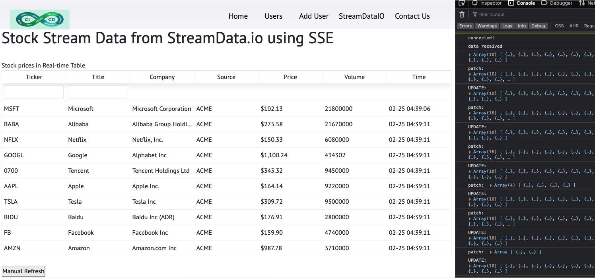

# CICD Demo for k8s deployment
## CICD Architecture


```sh
1. Develop an API with Github repository integration
2. Test and validate locally
3. Jenkins Job:
   1. build docker image
   2. push image to Dockerhub
   3. initiate CD flow.
4. Operator (once notified), updates the build number then pushes to Helm repository.
5. ArgoCD listens to the change and if there is a change event then intiates the new k8s deployment.
```

## 1. Continuous Integration (CI) for Backend APIs
&nbsp;&nbsp;&nbsp;&nbsp;### 1a. APIs without Security enforcement
```sh
- POST '/api/cicd/user' to createUser
- PUT '/api/cicd/user/:id' to updateUser
- DELETE '/api/cicd/user/:id' to deleteUser
- GET '/api/cicd/user/:id' to getUserById
- GET '/api/cicd/users' to get all Users
```
&nbsp;&nbsp;&nbsp;&nbsp;Example: http://[server]:[port]/api/cicd/apikey/users


&nbsp;&nbsp;&nbsp;&nbsp;### 1b. API Security enforcement - using APIkey in HTTP Header
```sh
- POST '/api/cicd/apikey/user' to createUser
- PUT '/api/cicd/apikey/user/:id' to updateUser
- DELETE '/api/cicd/apikey/user/:id' to deleteUser
- GET '/api/cicd/apikey/user/:id' to getUserById
- GET '/api/cicd/apikey/users' to get all Users
```
Example: http://[server]:[port]/api/cicd/apikey/users


### 2. Microservices Design pattern - Aggregator Pattern
Aggregator is a basic web page (in this case frontend web page) which invokes various services to achieve the required functionality.
The above backend API services are the REST endpoint used by the frontend web page(s).

For this demo, application is developed using the `MERN` stack


```sh
- MongoDB - document database
- Express(.js) - Node.js web framework
- React(.js) - a client-side JavaScript framework
- Node(.js) - the premier JavaScript web server
```
## 2. GitOps - ArgoCD
ArgoCD is a declarative, GitOps continuous delivery tool for Kubernetes.

For this demo, one ArgoCD app has been registered to meet CD requirement:


Github source for this demo is at 
https://github.com/simhead/cicd-demo-gitops-argocd

## 3. Service Mesh - Istio
For this demo, Istio has been used to support the distributed microservices architecture.


By adding a proxy "sidecar" (a.k.a. Envoy proxy) with every application deployed, 
Istio lets developers to program application-aware traffic management, observability, and 
robust security capabilities into the network.

## 4. Observability - Grafana and Kiali
Istio integrates with Kiali telemetry applicaiton. 
The Kiali dashboard provides service mesh deployment information, such as:

- display the topology of the mesh,
- analyze the health of the mesh.


The Grafana dashboard also implemented to monitor the health of Istio and of applications within the service mesh.

## 5. API Streaming - StreamData.io
This is Server-Side-Event API (a.k.a event-driven API) - 
using the sample API provided by Streamdata.io provider. 



An SSE event stream is delivered as a streaming HTTP response.
i.e. the client initiates a regular HTTP request,
the server responds with a custom `text/event-stream` content-type,
and then streams the UTF-8 encoded event data.

NOTE: A quick demo done at frontend github repository (https://github.com/simhead/cicd-demo-frontend.git) 
using the sample API provided from http://stockmarket.streamdata.io/v2/prices


